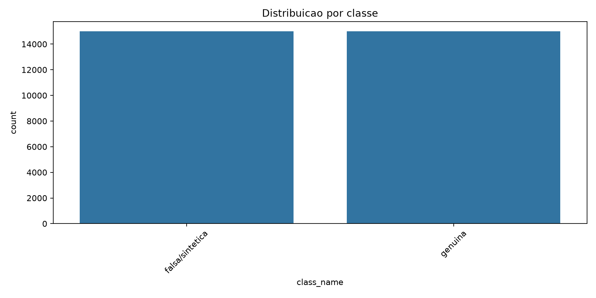
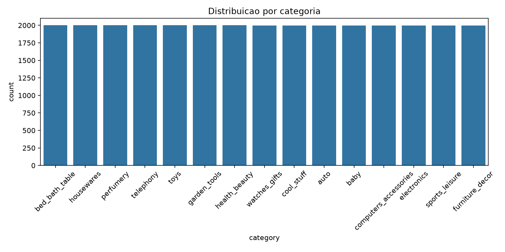
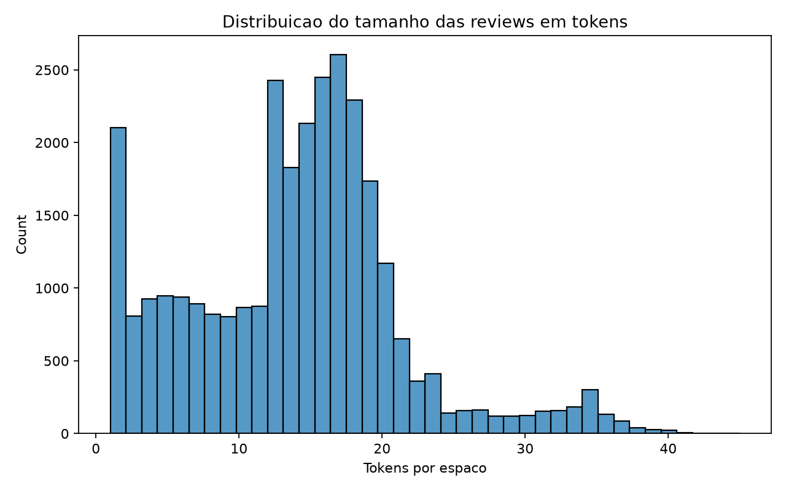
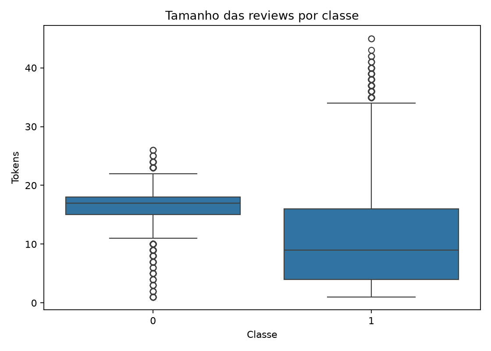
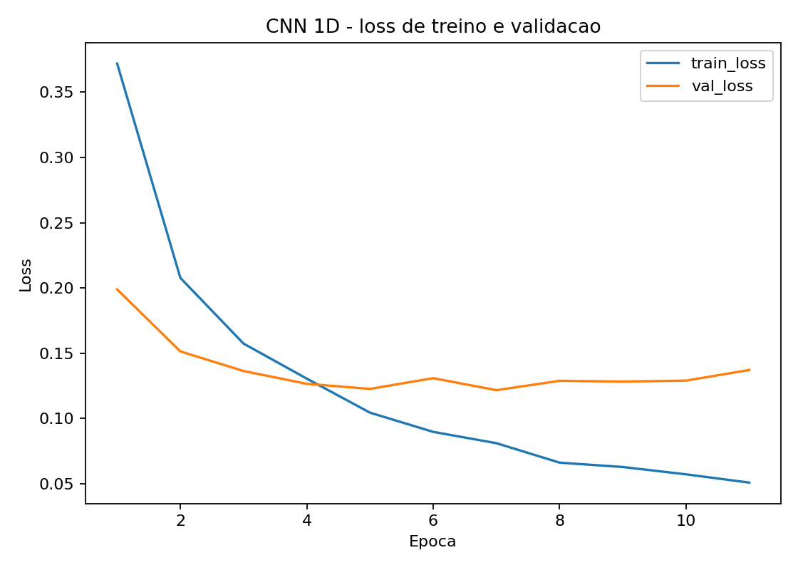
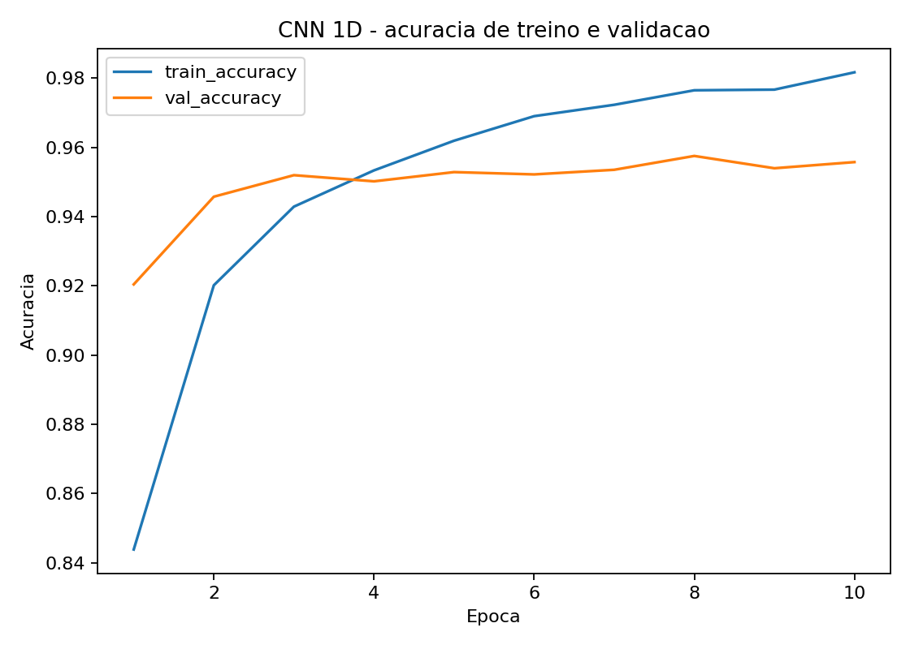
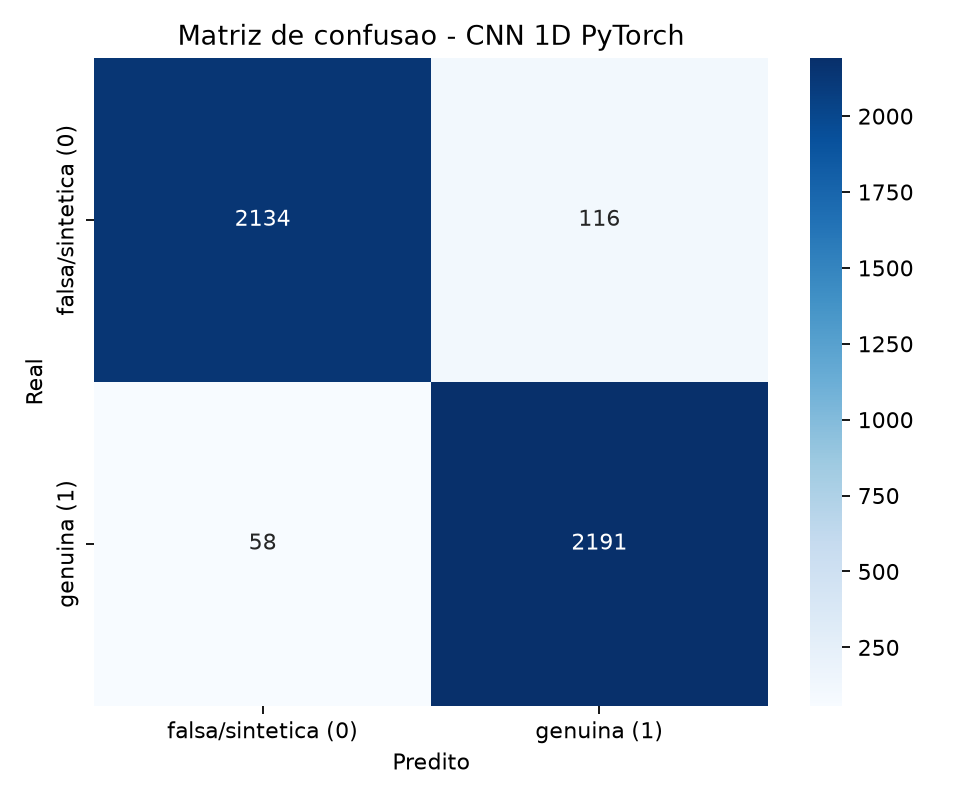
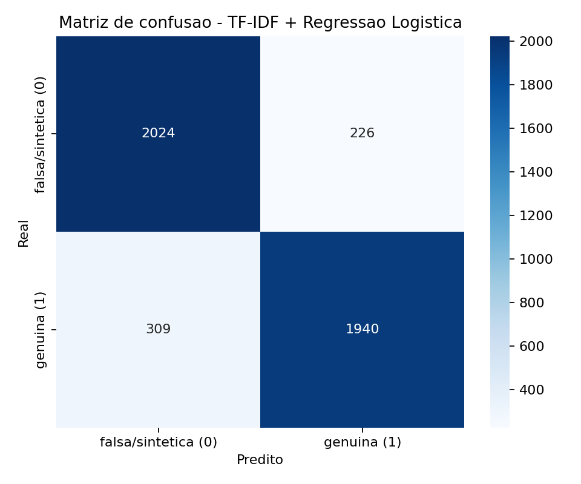
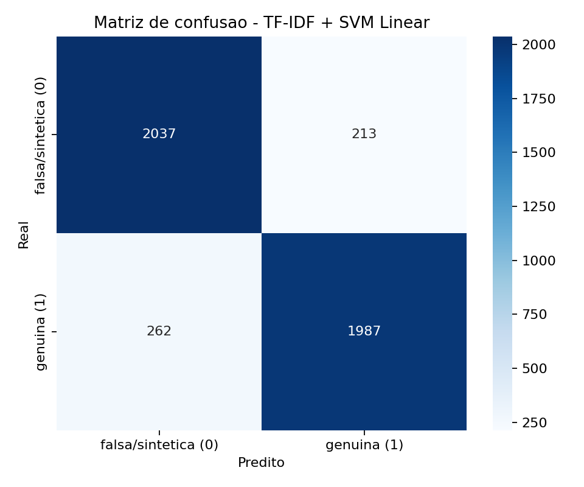

# Detecção de Reviews Falsas/Sintéticas em Português Brasileiro usando CNN 1D

Estudante: Randerson Sousa de Sá Nunes

Professor: Prof. Dr. Rafael Torres Anchieta

Disciplina: Aprendizado Profundo

Data: Julho de 2026

Repositório do projeto: https://github.com/Altaeir-13/Indago-PT-Detecting-Synthetic-Reviews-in-Brazilian-Portuguese

## 1. Introdução

As avaliações publicadas em plataformas de comércio eletrônico exercem influência direta sobre a confiança dos consumidores, a reputação de lojas e a decisão de compra. Nesse contexto, a presença de avaliações artificiais, enganosas ou sintéticas pode comprometer a percepção pública sobre produtos e serviços. Este trabalho investiga um recorte específico desse problema: a classificação textual de avaliações individuais em português brasileiro como genuínas ou falsas/sintéticas.

A tarefa de aprendizado abordada é uma classificação binária supervisionada. A entrada do sistema é o texto de uma avaliação e a saída é um rótulo numérico, em que 0 representa uma avaliação falsa/sintética e 1 representa uma avaliação genuína. O modelo principal utilizado é uma rede neural convolucional unidimensional, implementada em PyTorch, comparada com dois modelos de referência baseados em TF-IDF: Regressão Logística e SVM Linear.

A escolha da CNN 1D é motivada pela capacidade desse tipo de arquitetura de capturar padrões locais em sequências textuais, como combinações curtas de palavras e expressões recorrentes. Trata-se de uma arquitetura adequada para demonstrar um pipeline completo de aprendizado profundo, mantendo menor complexidade computacional em comparação com modelos contextuais pré-treinados, como BERTimbau.

## 2. Apresentação do Dataset

O conjunto de dados utilizado neste trabalho foi o Fake Reviews PT-BR Dataset, disponibilizado publicamente por Borges (2025) em repositório no GitHub. Esse corpus foi construído a partir de avaliações genuínas extraídas da base pública Brazilian E-Commerce Public Dataset by Olist e de avaliações falsas/sintéticas geradas por GPT-2 em português brasileiro. O dataset utilizado no experimento contém avaliações textuais, categorias de produtos e rótulos binários associados à distinção entre reviews genuínas e falsas/sintéticas.

O dataset está disponível no repositório público Fake Reviews PT-BR Dataset, mantido por Borges (2025), em: https://github.com/cristianomg10/fake-reviews-ptbr-dataset. A base original Olist, organizada por Olist e Sionek (2018), está disponível em: https://www.kaggle.com/datasets/olistbr/brazilian-ecommerce. No experimento, foi utilizado o arquivo true_fake_dataset_top15.csv, contendo as colunas descritas na Tabela 1.

Tabela 1 - Campos do dataset utilizado.

| Campo lógico | Nome da coluna | Descrição |
|---|---|---|
| Texto da avaliação | review_comment_message | Conteúdo textual da review |
| Categoria | product_category_name | Categoria do produto |
| Rótulo | label | 0 para falsa/sintética; 1 para genuína |

Após a etapa de limpeza mínima, o conjunto de dados considerado no experimento totalizou 29.988 amostras. A classe 0 corresponde a avaliações falsas/sintéticas e a classe 1 corresponde a avaliações genuínas. Os dados são textos em português brasileiro, organizados em formato tabular, acompanhados por categoria de produto e rótulo supervisionado.

A entrada textual pode ser representada formalmente como:

```text
X = (x_1, x_2, ..., x_T)
```

Nessa representação, T corresponde ao tamanho da sequência textual e x_t representa o token observado na posição t. Antes de ser processado pela rede neural, o texto é tokenizado, truncado ou preenchido por padding e convertido em índices de vocabulário.

Tabela 2 - Exemplos curtos de avaliações do dataset.

| Classe | Categoria | Exemplo curto |
|---|---|---|
| 0 - falsa/sintética | garden_tools | "Demorou um pouco pra chegar, mas fiquei feliz com a compra..." |
| 1 - genuína | health_beauty | "Sempre comprei neste site e nunca tive qualquer problema..." |





## 3. Limitações e Tratamento do Dataset

A limpeza aplicada aos textos foi propositalmente mínima, com o objetivo de preservar sinais linguísticos potencialmente úteis para a classificação. Foram removidas avaliações vazias, e foram normalizados espaços consecutivos e quebras de linha. Não foi realizada remoção agressiva de pontuação, acentos ou marcas lexicais, pois tais elementos podem contribuir para a distinção entre os padrões textuais das classes.

A análise exploratória indicou ausência de valores nulos nas colunas canônicas após o carregamento, mas identificou 683 linhas duplicadas e 1.537 textos duplicados. Também se observou que as avaliações são relativamente curtas, com média de 82,95 caracteres e 13,98 tokens por review, além de mediana de 15 tokens.

A principal limitação conceitual do dataset está relacionada à natureza da classe falsa. Essa classe é sintética e operacional, pois foi gerada por GPT-2, e não representa necessariamente fraude humana comprovada. Além disso, o conjunto de dados não contém usuário, data, rating, produto específico ou relações entre contas. Portanto, este trabalho não realiza detecção completa de astroturfing, limitando-se à classificação de avaliações individuais.





## 4. Trabalhos Relacionados

Borges et al. (2025) apresentam um benchmark de algoritmos de aprendizado de máquina para detecção de fake reviews em português brasileiro. Esse trabalho é diretamente relacionado ao presente estudo por tratar do mesmo domínio e por disponibilizar uma base pública adequada à investigação de avaliações falsas/sintéticas.

Kim (2014) propôs o uso de redes neurais convolucionais para classificação de sentenças, demonstrando que filtros convolucionais aplicados sobre embeddings podem capturar padrões discriminativos em texto. Essa referência fundamenta a escolha da CNN 1D como arquitetura principal deste trabalho.

Souza, Nogueira e Lotufo (2020) introduziram o BERTimbau, um modelo contextual pré-treinado para português brasileiro. Embora modelos baseados em BERT sejam relevantes para trabalhos futuros, eles não foram implementados neste experimento, pois o objetivo da avaliação foi treinar e analisar diretamente uma CNN 1D. Devlin et al. (2019) e Goodfellow, Bengio e Courville (2016) também são referências importantes para contextualizar modelos Transformer e fundamentos de aprendizado profundo.

## 5. Método Implementado

O método implementado segue um pipeline textual composto pelas seguintes etapas: texto da avaliação, tokenização, padding ou truncamento, embedding treinável, convolução unidimensional, função de ativação ReLU, Global Max Pooling, dropout, camada linear e saída binária. A camada de embedding converte tokens discretos em vetores densos. A convolução unidimensional aplica filtros locais sobre a sequência, buscando padrões curtos de palavras. A função ReLU introduz não linearidade ao modelo, enquanto o Global Max Pooling seleciona os sinais mais intensos detectados pelos filtros.

O dropout foi utilizado como mecanismo de regularização para reduzir overfitting. A camada linear final gera um logit, que é usado diretamente pela função BCEWithLogitsLoss durante o treinamento. Essa função combina a sigmoid e a entropia cruzada binária de forma numericamente estável.

Trecho 1 - Definição das principais camadas da CNN 1D em src/train_cnn.py.

```python
self.embedding = nn.Embedding(vocab_size, embedding_dim, padding_idx=0)
self.conv = nn.Conv1d(
    in_channels=embedding_dim,
    out_channels=filters,
    kernel_size=kernel_size,
)
self.relu = nn.ReLU()
self.dropout = nn.Dropout(dropout)
self.classifier = nn.Linear(filters, 1)
```

## 6. Configuração Experimental

O experimento foi desenvolvido em Python. A implementação da CNN 1D foi realizada com PyTorch, enquanto os modelos de referência foram treinados com scikit-learn. As bibliotecas pandas e numpy foram utilizadas para manipulação dos dados, e matplotlib e seaborn foram empregadas na geração dos gráficos.

A divisão dos dados foi estratificada em treino, validação e teste, nas proporções de 70%, 15% e 15%, respectivamente, com random_state igual a 42. Os modelos avaliados foram TF-IDF com Regressão Logística, TF-IDF com SVM Linear e CNN 1D em PyTorch. As métricas foram calculadas no conjunto de teste.

Tabela 3 - Hiperparâmetros principais da CNN 1D.

| Parâmetro | Valor |
|---|---:|
| vocab_size | 20000 |
| max_len | 128 |
| embedding_dim | 128 |
| filters | 128 |
| kernel_size | 5 |
| dropout | 0.5 |
| learning_rate | 0.001 |
| batch_size | 64 |
| epochs | 30 |
| patience | 4 |

Tabela 4 - Modelos avaliados no experimento.

| Modelo | Representação | Finalidade |
|---|---|---|
| TF-IDF + Regressão Logística | TF-IDF | Baseline linear probabilístico |
| TF-IDF + SVM Linear | TF-IDF | Baseline linear de margem |
| CNN 1D PyTorch | Tokens e embedding treinável | Modelo principal de deep learning |

Foram utilizadas as seguintes métricas: acurácia, precisão para a classe falsa/sintética, recall para a classe falsa/sintética, F1-score para a classe falsa/sintética, F1 macro, AUC-ROC orientada para a classe 0 e matriz de confusão. A classe de interesse foi definida como label 0, pois representa a avaliação falsa/sintética.

## 7. Resultados

A Tabela 5 apresenta os resultados reais do experimento no conjunto de teste. A CNN 1D em PyTorch obteve o melhor desempenho geral, superando os dois modelos de referência baseados em TF-IDF.

Tabela 5 - Resultados quantitativos no conjunto de teste.

| Modelo | Accuracy | Precision 0 | Recall 0 | F1 0 | F1 macro | AUC-ROC 0 |
|---|---:|---:|---:|---:|---:|---:|
| TF-IDF + Regressão Logística | 0.885086 | 0.866385 | 0.910667 | 0.887974 | 0.885009 | 0.949770 |
| TF-IDF + SVM Linear | 0.897533 | 0.882428 | 0.917333 | 0.899542 | 0.897492 | 0.962379 |
| CNN 1D PyTorch | 0.949544 | 0.950557 | 0.948444 | 0.949499 | 0.949544 | 0.987807 |

A CNN 1D atingiu 0,949544 de acurácia, 0,949499 de F1-score para a classe falsa/sintética, 0,949544 de F1 macro e 0,987807 de AUC-ROC orientada para a classe 0. Entre os baselines, o SVM Linear apresentou desempenho superior ao da Regressão Logística.







## 8. Análise e Discussão

A CNN 1D apresentou o melhor desempenho geral do experimento. Em comparação com o SVM Linear, a CNN obteve ganho aproximado de 5,2 pontos percentuais de acurácia. Esse resultado sugere que o uso de embeddings treináveis e filtros convolucionais foi eficaz para capturar padrões locais relevantes nas avaliações textuais.

O SVM Linear foi o baseline clássico mais forte, indicando que representações TF-IDF continuam competitivas em tarefas de classificação textual. A Regressão Logística também apresentou desempenho consistente, mas inferior ao SVM Linear e à CNN 1D.

A AUC-ROC elevada da CNN indica boa separação entre reviews sintéticas e genuínas no conjunto de teste. As curvas de treinamento mostram que o menor valor de perda de validação ocorreu na época 7, e o treinamento foi encerrado posteriormente por early stopping. A matriz de confusão da CNN reforça a interpretação de que o modelo apresentou desempenho equilibrado entre as classes.

Apesar dos resultados positivos, a interpretação deve ser cautelosa. A classe falsa foi gerada por GPT-2, o que significa que o modelo pode ter aprendido padrões específicos do gerador ou do processo de construção do dataset. Assim, os resultados não devem ser interpretados como detecção de fraude humana real ou de astroturfing completo.





## 9. Análise Qualitativa de Erros

A análise qualitativa de erros foi realizada a partir das predições da CNN 1D no conjunto de teste. Falsos positivos correspondem a avaliações genuínas classificadas como falsas/sintéticas. Falsos negativos correspondem a avaliações falsas/sintéticas classificadas como genuínas.

Tabela 6 - Exemplos curtos de erros da CNN 1D.

| Tipo de erro | Interpretação | Exemplo curto |
|---|---|---|
| Falso positivo | Genuína predita como falsa/sintética | "Ainda é cedo para avaliar o produto." |
| Falso negativo | Falsa/sintética predita como genuína | "Não gostei dos travesseiros... prazo de entrega é muito longo..." |

Esses casos sugerem que avaliações muito curtas, genéricas, padronizadas ou com poucos detalhes concretos podem ficar próximas da fronteira de decisão do modelo. Também é possível que alguns textos sintéticos imitem padrões reais das avaliações da Olist, dificultando a separação exclusivamente com base em características textuais.

## 10. Comparação com Trabalhos Relacionados

A comparação com a literatura deve considerar que os protocolos, conjuntos de dados, métricas e objetivos não são idênticos. Ainda assim, a Tabela 7 posiciona o presente trabalho em relação a referências relevantes da área.

Tabela 7 - Comparação qualitativa com trabalhos relacionados.

| Trabalho | Dataset | Modelo | Métrica/resultado | Observação |
|---|---|---|---|---|
| Borges et al. (2025) | Fake Reviews PT-BR | Modelos clássicos e representações textuais/contextuais | Benchmark de referência | Protocolos não reproduzidos integralmente neste trabalho |
| Kim (2014) | Sentenças em inglês | CNN para classificação textual | Referência arquitetural | Fundamenta o uso de convolução em texto |
| Souza et al. (2020) | Corpora em português | BERTimbau | Modelo pré-treinado | Extensão futura para comparação contextual |
| Este trabalho | Fake Reviews PT-BR | CNN 1D PyTorch | F1 macro 0,949544; AUC 0,987807 | Implementação própria e reprodutível |

## 11. Conclusão

Este trabalho apresentou um experimento completo para classificação de reviews falsas/sintéticas em português brasileiro usando uma CNN 1D em PyTorch. O pipeline incluiu carregamento do dataset, limpeza mínima, análise exploratória, divisão estratificada, treinamento de baselines, treinamento do modelo neural, avaliação quantitativa e análise qualitativa de erros.

A CNN 1D superou os baselines avaliados, atingindo 0,949544 de acurácia e 0,949544 de F1 macro. Esses resultados indicam que uma arquitetura convolucional simples pode ser competitiva para a classificação textual neste dataset. Contudo, as conclusões devem permanecer restritas ao escopo do experimento: o modelo distingue avaliações genuínas de avaliações sintéticas geradas no dataset, mas não comprova detecção de fraude humana nem de astroturfing completo.

Como continuidade, o projeto pode ser reaproveitado em um Trabalho de Conclusão de Curso como pipeline experimental reutilizável, como etapa intermediária entre modelos TF-IDF e BERTimbau, e como base para discussão de ameaças à validade. Trabalhos futuros podem incluir comparação com BERTimbau, CNN multi-kernel, validação cruzada, deduplicação antes da divisão dos dados e uso de metadados comportamentais ou grafos quando houver dados apropriados.

## 12. Declaração de Uso de IA Generativa

Ferramentas de IA generativa foram utilizadas como apoio na estruturação do código, na organização da documentação, na revisão textual e na diagramação dos artefatos finais. As métricas, tabelas e figuras apresentadas neste relatório foram geradas pelo experimento executado no projeto, a partir dos arquivos reais produzidos pelo pipeline.

## 13. Referências

BORGES, Eduardo C. R. et al. Benchmarking Machine Learning Algorithms in Fake Reviews Detection in Brazilian Portuguese. Revista Brasileira de Computação Aplicada, 2025.

BORGES, Eduardo C. R. Fake Reviews PT-BR Dataset. 2025. Disponível em: https://github.com/cristianomg10/fake-reviews-ptbr-dataset.

OLIST; SIONEK, Andre. Brazilian E-Commerce Public Dataset by Olist. 2018. Disponível em: https://www.kaggle.com/datasets/olistbr/brazilian-ecommerce.

KIM, Yoon. Convolutional Neural Networks for Sentence Classification. EMNLP, 2014.

DEVLIN, Jacob et al. BERT: Pre-training of Deep Bidirectional Transformers for Language Understanding. NAACL-HLT, 2019.

SOUZA, Fábio; NOGUEIRA, Rodrigo; LOTUFO, Roberto. BERTimbau: Pretrained BERT Models for Brazilian Portuguese. BRACIS, 2020.

GOODFELLOW, Ian; BENGIO, Yoshua; COURVILLE, Aaron. Deep Learning. MIT Press, 2016.

PEDREGOSA, Fabian et al. Scikit-learn: Machine Learning in Python. Journal of Machine Learning Research, 2011.

PASZKE, Adam et al. PyTorch: An Imperative Style, High-Performance Deep Learning Library. NeurIPS, 2019.
